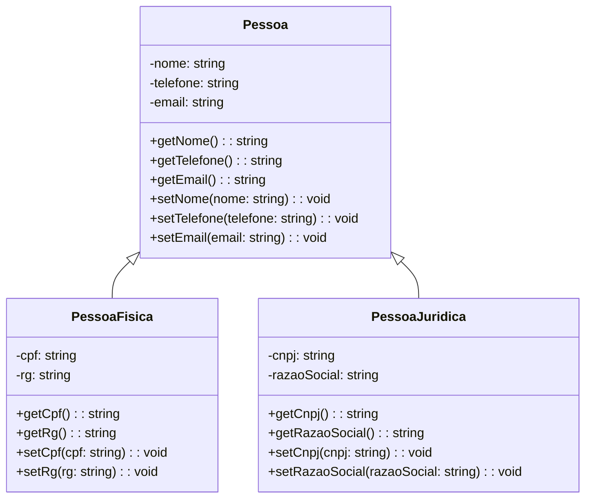

# README - Atividade de Orientação a Objetos em Java

Este projeto em Java tem como objetivo proporcionar uma compreensão prática dos conceitos fundamentais de orientação a objetos. 
A atividade envolve a criação de classes representando pessoas físicas e jurídicas, além de uma classe abstrata para a generalização de características comuns.

## Diagrama de Classe



## Estrutura do Código

### Arquivos: App.java, PessoaFisica.java, PessoaJuridica.java, Pessoa.java

1. **Pacote e Autoria:**
   - O código está contido no pacote `edu.ebac`.
   - Autor: vinisantosn.

2. **Classe `App.java`:**
   - Método `main` cria instâncias de `PessoaFisica` e `PessoaJuridica`, atribui valores e demonstra o uso dos objetos.

3. **Classe `PessoaFisica.java`:**
   - Representa uma pessoa física com atributos específicos como `cpf` e `rg`.
   - Sobrescreve o método `toString()` para facilitar a exibição dos dados.

4. **Classe `PessoaJuridica.java`:**
   - Representa uma pessoa jurídica com atributos específicos como `cnpj` e `razaoSocial`.

5. **Classe Abstrata `Pessoa.java`:**
   - Classe abstrata que contém atributos comuns a pessoas, como `nome`, `telefone` e `email`.

## Execução do Programa

1. **Compilação:**
   - Antes de executar o programa, é necessário compilá-lo. Isso pode ser feito utilizando um compilador Java, como o `javac`.

     ```bash
     javac App.java PessoaFisica.java PessoaJuridica.java Pessoa.java
     ```

2. **Execução:**
   - Após a compilação, o programa pode ser executado com o seguinte comando:

     ```bash
     java App
     ```

3. **Resultados:**
   - O programa cria instâncias de `PessoaFisica` e `PessoaJuridica`, atribui valores e imprime os detalhes no console.

## Conceitos Demonstrados

1. **Herança:**
   - A classe abstrata `Pessoa` é utilizada para compartilhar atributos entre `PessoaFisica` e `PessoaJuridica`.

2. **Encapsulamento:**
   - Os atributos são encapsulados por meio de métodos de acesso (`get` e `set`).

3. **Polimorfismo:**
   - O método `toString()` é sobrescrito nas classes específicas (`PessoaFisica` e `PessoaJuridica`).

4. **Abstração:**
   - A classe abstrata `Pessoa` define atributos comuns que são generalizados para as classes derivadas.

